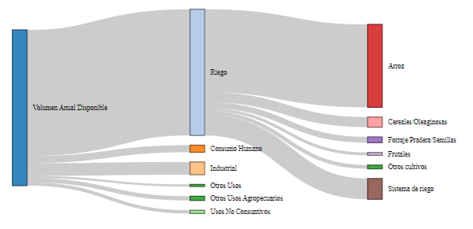

```{r setup, include=FALSE}
knitr::opts_chunk$set(echo = FALSE, message = FALSE, warning =FALSE, fig.align = "center", fig.pos = "H",fig.width=5.5,fig.height=3.5)
library(here)
library(tidyverse)
```

# Introducción

A lo largo de los últimos años, el cambio climático y las sequías han impactado significativamente a nuestro país, generando una creciente preocupación en torno al uso del agua. En este contexto, resulta fundamental analizar el aprovechamiento de los recursos hídricos en Uruguay. El presente trabajo tiene como objetivo principal explorar e informar sobre los diversos usos que se le da al agua en nuestro país. Para ello, se utilizarán los datos abiertos disponibles proporcionados por la Dirección Nacional del Agua (DINAGUA), específicamente el registro de empresas que realizan solicitudes para explotar los recursos hídricos.

Dentro de este estudio, nos planteamos responder a preguntas fundamentales, tales como:

1. ¿En qué se utiliza la mayor parte del agua que se solicita extraer?

2. ¿Qué sectores de la actividad requieren mayores volúmenes de agua?

3. ¿Qué zonas del país presentan mayores demanda de uso?

Para abordar estas preguntas, realizaremos un análisis exploratorio de los datos disponibles utilizando las diversas herramientas que proporciona R para el análisis de datos. Crearemos una aplicación utilizando la biblioteca Shiny, que permitirá visualizar de forma interactiva los resultados obtenidos en el informe, principalmente enfocados en responder la tres preguntas que se realizan en el informe.
Por último, vamos a ajustar un modelo predictivo con el objetivo de predecir el uso del agua utilizando las diversas variables de respuesta presentes en los datos.

# Datos

```{r, echo=FALSE,message=FALSE}
datos <- read_csv2(here("Datos","aprovechamientos_2023.csv"))
```

```{r}
datos_l <- datos %>%
           select(-"Regional",-"Estado",-"Tipo Solicitud",-"Fecha Solicitud",-"Fecha Resolución",-"Fecha Inscripción",
                  -"Fecha Vencimiento",-"produccion") %>%
           rename("cod_reg"= "nro_gex","nom_reg"= "Nombre","dpto"= "departamento",
                  "vol_anual"="Volumen Anual (m3)","tipo_ext"="Categoría","mes_anio"="Meses/Año") %>%
           rename_all(tolower) %>%
           distinct(cod_reg, .keep_all = TRUE) %>%
           mutate(dpto =factor(dpto),uso =factor(uso),destino =factor(destino)) %>%
           mutate(codcuenca_nv1=factor(substr(codcuenca, 1, 1))) %>%
           mutate(tipo_ext = str_to_title(tipo_ext),nom_reg=toupper(nom_reg)) %>%
           mutate(tipo_ext = case_when(tipo_ext == "Pozoestudio" ~ "Pozo",.default=tipo_ext)) %>%
           mutate(tipo_ext = factor(tipo_ext)) %>%
           mutate(inicio = as.Date(inicio)) %>%
           mutate(fin = as.Date(fin)) %>%
           mutate(dias_permiso = difftime(fin, inicio, units = "days")) %>%
           mutate(vol_anual = vol_anual/1e6)
```

Como se mencionó, los datos utilizados pertenecen a la Dirección Nacional del Agua, un ente perteneciente al Ministerio de Ambiente. Estos datos comprenden el registro de todas las empresas y entidades públicas que realizan extracciones de agua para diversos usos productivos o abastecimiento a la población. Los datos abarcan un total de 5167 registros que se encuentran actualmente habilitados para la explotación de recursos hídricos, con 19 variables que van desde el tipo de forma en que se extrae el agua hasta el departamento donde se encuentra la extracción.

\newpage 

Las principales variables de interés a analizar en los datos son:

```{r,echo=FALSE}
meta_datos <- tibble("Nombre Variable" = names(datos_l),
                  "Descripción" = c("Refiere al codigo identificador de la solicitud de extraccion frente a la DINAGUA.",
                                   "Nombre de la empresa, ente o persona registrada.", 
                                   "Departamento donde se encuentra la obra de extracción", 
                                   "Hace referencia al propósito o destino que se le dará al agua. Los usos se clasifican en consumo humano, uso industrial, riego, otros usos agropecuarios y otros usos adicionales.", 
                                   "Detalla el lugar o fin específico donde se utilizará el agua, por ejemplo, en el caso del riego, se especifica el tipo de cultivo.", 
                                   "Indica el volumen máximo de agua permitido para la extracción. Este valor depende en parte, por el tipo de obra utilizada para la extracción.", 
                                   "Fecha en la que se inicia la solicitud de extracción",
                                   "Fecha en la que caduca el permiso de extracción",
                                   "Se refiere al tipo de estructura utilizada para la extracción del agua, que puede ser a través de represas, tomas directas en ríos o pozos, entre otras opciones comunes.", 
                                   "Cantidad de meses en el año que se usa el agua que se extrae", 
                                   "Permite identificar la cuenca hidrográfica de nivel 2  a la cual se está realizando la extracción.", 
                                   "Permite identificar la cuenca hidrográfica de nivel 1 a la cual se está realizando la extracción.",
                                   "Diferencia en días entre la fecha inicio y fin"))

```

```{r, echo=FALSE,results='asis'}
tabla_md <- knitr::kable(meta_datos, format = "latex", booktabs = TRUE) %>%
            kableExtra::kable_styling( latex_options = c("striped", "hold_position"))%>%
            kableExtra::column_spec(2, width = "40em")
print(tabla_md, include.rownames = FALSE, caption = "Metadatos")
```

```{r, echo = FALSE,message=FALSE,warning=FALSE,results='hide'}
library(geouy)

invisible({mapa <- load_geouy("Cuencas hidro N2") %>%
         mutate(nombrec2=iconv(nombrec2, from = "ISO-8859-1", to = "UTF-8"),
         popup=iconv(popup, from = "ISO-8859-1", to = "UTF-8"))})  

# Cantidad de registros por cuenca
reg_cuenca <- datos_l %>%
              group_by(codcuenca) %>%
              summarise(n_reg=n())

# Uso con mayor volumen por cuenca
uso_cuenca <- datos_l %>%
              group_by(codcuenca,uso) %>%
              summarise(vol_anual_uso = sum(vol_anual)) %>%
              slice_max(order_by = vol_anual_uso, n = 1) 

# Destino con mayor volumen por cuenca          
dest_cuenca <- datos_l %>%
               group_by(codcuenca,destino) %>%
               summarise(vol_anual_dest = sum(vol_anual)) %>%
               slice_max(order_by = vol_anual_dest, n = 1) 
              
# Volumen total por cuenca
vol_cuenca <- datos_l %>% 
              group_by(codcuenca) %>%
              summarise(vol_anual = sum(vol_anual))

datos_cuenca <- left_join(mapa, reg_cuenca, by = "codcuenca") %>% 
                left_join(uso_cuenca, by = "codcuenca") %>%
                left_join(dest_cuenca, by = "codcuenca") %>%
                left_join(vol_cuenca, by = "codcuenca")
```

# Análisis exploratorio de los datos

Con el objetivo de responder las preguntas planteadas, se centrará en el volumen anual permitido de extracción de agua, así como en el uso y destino asignado a la misma. También se tomará en cuenta la cuenca hidrográfica de origen de la extracción. Para llevar a cabo este análisis, utilizaremos la librería GeoUY, la cual nos facilita el uso de datos geográficos de Uruguay de manera cómoda y sencilla en R.
El siguiente gráfico muestra la cantidad total de solicitudes de extracción agrupadas por su uso. En Uruguay, un país cuya producción está estrechamente vinculada al sector agrícola, se observa una marcada mayoría de empresas que realizan extracciones para uso agropecuario, tanto para riego como para otros fines, que incluyen el uso para abrevaderos de ganado, tambos, entre otros.

```{r,echo=FALSE}
reg_uso <- datos_l %>%
  group_by(uso) %>%
  ggplot() + geom_bar(aes(x=fct_infreq(uso),fill=uso)) +
  scale_y_continuous(name="Cantidad de registros") + 
  scale_x_discrete(name="Usos") +
  coord_flip() +
  theme(legend.position = "none")
```

```{r,fig.cap="Cantidad de registros por uso"}
#Gráfico de barras que muestra la cantidad de solicitudes agrupadas según su uso
reg_uso
```

En principio, parece que los usos agropecuarios representarán la mayoría del consumo de agua. Ahora, analicemos el volumen anual permitido de extracción según los diferentes usos.

```{r, fig.cap="Volumen anual disponible por uso"}
volumen_total_uso <- datos_l %>%
  group_by(uso) %>%
  summarise(volumentotal = sum(vol_anual)) %>%
  select(uso, volumentotal)

plot_vol_uso <- ggplot(volumen_total_uso, 
                       aes(x=fct_reorder(uso, -volumentotal), y = volumentotal, fill=uso)) +
  geom_bar(stat = 'identity') +
  scale_y_continuous(name="Volumen (miles de m3)") + 
  scale_x_discrete(name="Usos") +
  coord_flip() +
  theme(legend.position = "none")

plot_vol_uso
```

Observamos una marcada diferencia en el volumen destinado al riego en comparación con los demás usos, lo cual es significativo. Aproximadamente el 80% del volumen anual permitido de extracción en el país se destina al riego.

Dado que el riego pareciera ser el uso mayoritario del agua, vamos a examinar cómo se distribuye en todo Uruguay el uso del agua. El siguiente gráfico muestra, para cada cuenca hidrográfica, cuál es el uso con el mayor volumen autorizado en cada cuenca. 

```{r}
plotm_uso <- ggplot() + geom_sf(data=datos_cuenca,aes(fill=uso)) + 
             theme(axis.text = element_blank(),axis.ticks = element_blank()) + scale_fill_discrete(name="Uso mayoritario")
```

```{r, fig.cap="Mapa uso mayoritario en cada cuenca"}
# Mapa fraccionado por cuencas nivel 2, reflejando el uso que tiene el mayor volumen máximo de agua autorizado para cada cuenca
plotm_uso
```

Podemos observar cómo lo que hemos visto en los gráficos anteriores se refleja en el mapa, donde casi todas las cuencas del país presentan un uso mayoritario hacia el riego. Además, es interesante notar que en las cuencas del sur del país, donde se concentra una mayor población, el uso mayoritario pasa a ser el consumo humano.

Ahora, examinaremos un gráfico más detallado que diferencie por destinos que se le asignan al agua y el volumen anual permitido para su extracción en cada cuenca. Obteniéndose el siguiente gráfico:

```{r}
plotm_dest <- ggplot(data = datos_cuenca) +
  geom_sf(aes(fill = destino)) +
  stat_sf_coordinates(aes(size = vol_anual_dest), alpha = 0.5, color="darkblue") +
  theme(axis.text = element_blank(), axis.ticks = element_blank(), axis.title = element_blank(),legend.text = element_text(size = 6), legend.title = element_text(size=8),legend.key.height= unit(0.4, 'cm'),
        legend.key.width= unit(0.4, 'cm')) +
  scale_fill_discrete(name = "Destino") +
  scale_size_continuous(name = "Volumen Anual (millones de m3)", range = c(1,7))
```

```{r,fig.cap="Mapa destino mayoritario en cada cuenca y volumen anual permitido a extraer"}
# Mapa fraccionado por cuencas nivel 2, reflejando el destino que tiene el mayor volumen máximo de agua autorizado para cada cuenca, y el volumen total según el máximo uso
plotm_dest
```

En el gráfico se puede observar que en la mayoría de las cuencas, el destino con los mayores volúmenes de agua es el cultivo de Arroz, seguido por el uso de "Cereales/Oleaginosas". Ahora vamos a examinar de manera diferenciada cómo se distribuye el volumen anual permitido para el uso "Riego".

```{r}
agr_vol <- datos_l %>%
  filter(uso == "Riego") %>%
  group_by(destino) %>%
  summarise(volumentotal = sum(vol_anual))

plot_agr_vol <- ggplot(agr_vol, 
                       aes(x=fct_reorder(destino, -volumentotal), y = volumentotal, fill=destino)) +
  geom_bar(stat = 'identity') +
  scale_y_continuous(name="Volumen (miles de m3)") + 
  scale_x_discrete(name="Cultivo") +
  coord_flip() +
  theme(legend.position = "none")
```

```{r, fig.cap="Grafico volumen anual disponible por cultivo"}
plot_agr_vol
```

Visto los datos, queda evidente que el cultivo de arroz se posiciona como el cultivo que precisa mas extracción de agua, por encima de cualquier otro cultivo.
Podemos preguntarnos también quienes tienen el máximo volumen permitido para uso viendo los 10 registros con mayor volumen tenemos los siguientes:

```{r}
reg_max <- datos_l %>%
           arrange(desc(vol_anual)) %>%
           slice_head(n = 10) %>%
           select(cod_reg,nom_reg,dpto,uso,vol_anual) %>%
           rename("Codigo de registro"="cod_reg","Nombre de registro"="nom_reg","Departamento"="dpto",
                  "Uso"="uso","Volumen anual"="vol_anual")
```

```{r,results='asis'}
tabla_emp <- knitr::kable(reg_max, format = "latex", booktabs = TRUE) %>%
            kableExtra::kable_styling( latex_options = c("striped", "hold_position","scale_down"))
print(tabla_emp, include.rownames = FALSE,caption="Empresas con mayor volumen anual permitido")
```

Al examinar las principales empresas registradas, se observa que las dos primeras corresponden a las plantas de celulosa de UPM. Estas plantas tienen los mayores volúmenes anuales permitidos de extracción, lo cual tiene sentido considerando su producción y dimensiones. Además, se destaca que una gran proporción de los registros en los primeros puestos están relacionados con empresas dedicadas al cultivo del arroz. .


Como conclusión del análisis de los datos, vemos que el enfoque al agro de la producción uruguaya repercute en los usos que se le da al agua donde es predominantemente utilizada para el riego, se destaca claramente cómo en las zonas del este del país, donde el arroz es el cultivo predominante, el volumen de agua utilizado es considerablemente mayor. Por otro lado, en las zonas del sur se percibe que el consumo humano se presenta como el uso mayoritario, especialmente en las cuencas cercanas a Montevideo. En la zona oeste del país, en cambio, prevalece el uso del agua para la producción de cereales y oleaginosas. Es importante tener en cuenta un detalle de los datos: al solo estar contabilizándose las extracciones, cultivos como el arroz, que requieren un gran traslado de agua para su producción, van a quedar en evidencia. No se podrían sacar conclusiones con los datos disponibles sobre qué cultivos tienen un mejor rendimiento de producción/volumen de agua consumidos, ya que no se estaría considerando, por ejemplo, el efecto que tienen los cultivos de soja en las aguas subterráneas, que no requieren de una extracción y no aparecen en estos datos. Este informe es solo un punto de partida para lo que podrían ser estudios más detallados sobre el tema, haciéndose preguntas como si deberíamos revisar nuestra matriz productiva en pos de asegurar los recursos hídricos en el futuro, o qué efectos tienen otras industrias, como la forestal, que no están contemplados en estos datos en la disponibilidad del agua.
 
# Aplicacion de Shiny

Para visualizar de manera interactiva los diferentes usos del agua, optamos por utilizar un mapa que muestre los destinos en las distintas cuencas y permita filtrarlos según los usos. Para lograr esto, utilizamos nuevamente los mapas disponibles en la biblioteca 'GeoUY' y la librería 'GGIRAPHE' para crear un mapa interactivo. La idea es crear un mapa que resuma en gran medida lo que hemos observado en el análisis exploratorio.

Después de analizar varias opciones de visualización, los datos se presentan a realizar un diagrama Sankey. Este tipo de diagrama nos permite visualizar de manera bivariada los datos de volúmenes y los diferentes usos del agua, proporcionando una representación clara de como se distribuye el volumen de agua. Utilizaremos "NetworkD3" para la creación de los diagramas una librería que se adapta perfectamente para utilizar en una aplicación Shiny.


```{r, eval = FALSE}
library(networkD3)

uso_sankey <- datos_l %>%
              group_by(uso) %>%
              summarise(vol_anual = sum(vol_anual))


volsk_total <- sum(uso_sankey$vol_anual)

nodos_sankey <- data.frame(
  name=c(as.character(links_sankey$source), 
  as.character(links_sankey$target)) %>% unique()
)

links_sankey$IDsource <- match(links_sankey$source, nodos_sankey$name)-1 
links_sankey$IDtarget <- match(links_sankey$target, nodos_sankey$name)-1

sankey_vol <- sankeyNetwork(Links = links_sankey, Nodes = nodos_sankey,
              Source = "IDsource", Target = "IDtarget",
              Value = "value", NodeID = "name", width= 600, height = 250,
              sinksRight=FALSE)

```

{height=250,width=600}

# Modelo predictivo

Se construye un modelo para determinar si el Uso que tendrá la solicitud de extracción va a ser para Riego, o para otros usos distintos de Riego. La clasificación sería de la siguiente forma:

* Riego
* Otros Usos

```{r}
library(rpart)
library(rpart.plot)
library(caret)
library(randomForest)

set.seed(358)

datos_mod <- datos_l %>%
             select(uso,vol_anual,mes_anio,tipo_ext, codcuenca_nv1, codcuenca,dias_permiso,dpto) %>%
             mutate(uso = case_when(uso != "Riego" ~"Otros Usos",.default=uso)) %>%
             na.omit() %>%
             mutate(uso=factor(uso))

# Separamos 70% para entrenamient, 30% testeo
datos_training <- sample_frac(datos_mod, .7)
datos_test <- setdiff(datos_mod, datos_training)
```

## Arbol 

**Resultados primer Árbol construido:**

```{r}
# Usamos rpart para estimar el árbol
arbol_1 <- rpart(formula = uso ~ dpto + vol_anual + tipo_ext + dias_permiso + codcuenca_nv1, data = datos_training)
```

```{r}
rpart.plot(arbol_1)
```

```{r}
# Realizamos las predicciones y mostramos la Matriz de resultados
prediccion_1 <- predict(arbol_1, newdata = datos_test, type = "class")
confusionMatrix(prediccion_1, datos_test[["uso"]])
```

## Arbol 2 - tratando el desbalance

**Debido a que nuestros datos se encuentran desbalanceados, realizamos un segundo árbol en el cual intentamos trabajar dicho desbalance**

Tabla de proporción de Usos según la cantidad de registros:
```{r}
#Vamos a tratar el desbalance

tabla_usos <- datos_mod %>%
              group_by(uso) %>%
              summarise(cantidad=n()) %>%
              mutate(porcentaje = round(((cantidad/sum(cantidad))*100), 2),
                     proporcion = round((cantidad/sum(cantidad)), 4)) %>%
              select(uso,proporcion) %>% 
              arrange(., desc(proporcion))

datos_arbol_2 <- left_join(datos_training, tabla_usos, by="uso")
```

```{r}
tabla_usos 
```


```{r}
arbol_2 <- rpart(formula = uso ~ dpto + vol_anual + tipo_ext + dias_permiso + codcuenca_nv1, data = datos_arbol_2, weight = proporcion)

rpart.plot(arbol_2)
```

```{r}
prediccion_2 <- predict(arbol_2, newdata = datos_test, type = "class")
confusionMatrix(prediccion_2, datos_test[["uso"]])
```


\newpage 
## Random Forest

**Probamos mejorar nuestro Accuracy con un Random Forest, obteniendo los siguientes resultados:**

```{r}
rf_1 <- randomForest(uso ~ codcuenca + vol_anual + tipo_ext + dias_permiso + codcuenca_nv1, data= datos_training, ntree = 150)
prediccion_3 <- predict(rf_1, newdata = datos_test, type = "class")
confusionMatrix(prediccion_3, datos_test[["uso"]])
```

*El modelo Random Forest con un Accuracy de 0.87 es el que mejor performa**